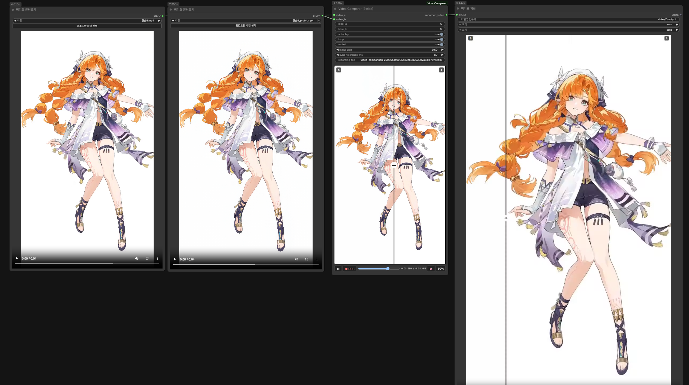

# ComfyUI Video Comparer


[](https://github.com/AIEGOBOT/ComfyUI-VideoComparer/actions/workflows/validate.yml)
[](https://github.com/comfyanonymous/ComfyUI)
[](https://www.python.org/)
[](LICENSE)

[English](#english) · [한국어](#한국어)

Compare two ComfyUI videos with a synchronized swipe preview, record the interaction,
and send the result directly to the core `Save Video` node.

ComfyUI 영상 두 개를 동기화된 스와이프로 비교하고, 조작 화면을 녹화해 코어
`Save Video` 노드로 바로 전달합니다.



<a href="docs/assets/video-comparer-demo.mp4">
  
</a>

Click the preview to watch the real recording. / 미리보기를 누르면 실제 녹화 영상을 볼 수 있습니다.

## English

### What it does

`Video Comparer (Swipe)` accepts two core ComfyUI `VIDEO` inputs. Video A is the
base/original; move the divider right to reveal more of video B.

- Synchronized play, pause, seek, loop, and drift correction.
- Hover or drag anywhere in the preview to move the divider.
- A/B labels, responsive preview, audio toggle, and 50% reset.
- Browser recording of the video, divider, handle, and labels.
- Direct recording output to ComfyUI's core `Save Video` node.
- No models or third-party Python packages required.

### Requirements

- ComfyUI `0.33.1` or newer.
- Python `3.10` or newer.
- A current Chromium-based browser is recommended for recording.

Tested with ComfyUI `0.33.1`, frontend `1.48.7`, and Python `3.12.10`.

### Install

#### ComfyUI Manager — recommended

Install the stable package from the Comfy Registry:

1. Open **Manager** → **Custom Nodes**.
2. Search the **Node Pack** list for `video-comparer` or `ComfyUI Video Comparer`.
3. Select the result from publisher `aiegobot`, choose a stable version, and click
   **Install**.
4. Restart ComfyUI and refresh the browser.

If Manager shows no result, the package may not be indexed yet. Use the manual Git
installation below. The new Manager UI does not provide **Install via Git URL**.

#### Manual Git install

Open a terminal in `ComfyUI/custom_nodes` and run:

```bash
git clone https://github.com/AIEGOBOT/ComfyUI-VideoComparer.git
```

Restart ComfyUI and refresh the browser. There is no `requirements.txt` because this
node has no additional Python dependencies.

For ZIP installation, download **Code → Download ZIP**, extract it, and place the
single `ComfyUI-VideoComparer` folder directly inside `ComfyUI/custom_nodes`.

Full instructions: [install, update, and uninstall guide](docs/INSTALLATION.md).

### Two-minute quickstart

1. Add two core `Load Video` nodes.
2. Add `Video Comparer (Swipe)` from `video/preview`.
3. Connect the original video to `video_a` and the comparison to `video_b`.
4. Connect `recorded_video` to the core `Save Video` node **before recording**.
5. Queue once. Wait until both previews appear.
6. Press `REC`, move the divider, and press the same recording button again.
7. The completed recording is uploaded and the save path is re-queued automatically.

The shared comparison duration is the shorter input duration. Recording is limited to
2 minutes and 512 MiB.

### Import an example workflow

Download a JSON file below and drag it onto the ComfyUI canvas, or use
**Workflows → Open**.

- [`video_comparer_smoke.json`](example_workflows/video_comparer_smoke.json): portable
  red/blue test; no model or input file required. Start here.
- [`video_comparer_load_and_record.json`](example_workflows/video_comparer_load_and_record.json):
  practical load, compare, record, and save layout.
- [Example workflow guide](example_workflows/README.md)

### Controls and ports

| Item | Purpose |
|---|---|
| `video_a` | Base/original core `VIDEO` and optional audio source. |
| `video_b` | Comparison core `VIDEO`, revealed from the left. |
| `recorded_video` | Latest swipe recording for core `Save Video`. |
| Play/pause | Controls both videos together. |
| Timeline | Seeks both videos to the same time. |
| `REC` | Starts and stops the composite browser recording. |
| Speaker | Mutes or enables audio from video A; B remains muted. |
| `50%` | Resets the divider to the center. |

Before a recording exists, `recorded_video` blocks execution so the initial preview
queue cannot accidentally save a source video.

### Files and privacy

- Temporary MP4 previews are stored in ComfyUI's temp directory; only the latest 12
  are retained during a session.
- Completed WebM recordings are stored in `ComfyUI/input/video_comparer_recordings`
  until you delete them.
- Videos are processed by your local ComfyUI server and browser. This node does not
  upload them to an external service.

### Troubleshooting

| Symptom | Fix |
|---|---|
| Node is missing after installation | Restart ComfyUI, refresh the browser, and check the startup log for `import failed`. |
| Preview is empty | Connect both core `VIDEO` inputs and queue once. |
| An MP4 will not connect | Load it with the core `Load Video` node. `VHS_FILENAMES` is a different type. |
| Recording is not saved | Connect `recorded_video` to core `Save Video` before pressing `REC`, then stop recording with the same button. |
| Browser downloads a WebM | Upload or automatic queueing failed, so a fallback copy was preserved. |
| Comparison ends early | This is expected: the shorter input defines the shared duration. |
| Recording will not start | Use a current Chromium-based browser and wait for both previews to load. |

See the [full troubleshooting guide](docs/TROUBLESHOOTING.md) or
[open a bug report](https://github.com/AIEGOBOT/ComfyUI-VideoComparer/issues/new/choose).

## 한국어

### 어떤 노드인가요?

`Video Comparer (Swipe)`는 ComfyUI 코어 `VIDEO` 입력 두 개를 받습니다. 비디오
A가 원본이며, 구분선을 오른쪽으로 움직일수록 비디오 B가 더 많이 나타납니다.

- 재생, 일시정지, 탐색, 반복과 재생 오차 자동 보정.
- 미리보기 어디서든 마우스를 움직이거나 드래그해 구분선 조작.
- A/B 라벨, 반응형 미리보기, 오디오 버튼과 50% 초기화.
- 영상, 구분선, 핸들과 라벨을 함께 브라우저에서 녹화.
- 녹화 결과를 ComfyUI 코어 `Save Video`로 바로 전달.
- 추가 모델과 외부 Python 패키지가 필요하지 않음.

### 필요 환경

- ComfyUI `0.33.1` 이상.
- Python `3.10` 이상.
- 녹화에는 최신 Chromium 계열 브라우저 권장.

ComfyUI `0.33.1`, 프론트엔드 `1.48.7`, Python `3.12.10`에서 확인했습니다.

### 설치

#### ComfyUI Manager — 권장

Comfy Registry의 안정 버전은 다음 순서로 설치합니다.

1. **Manager** → **Custom Nodes**를 엽니다.
2. **Node Pack** 목록에서 `video-comparer` 또는 `ComfyUI Video Comparer`를 검색합니다.
3. 게시자 `aiegobot`의 결과를 선택하고 안정 버전을 고른 뒤 **Install**을 누릅니다.
4. ComfyUI를 재시작하고 브라우저를 새로고침합니다.

검색 결과가 없다면 아직 Registry에 반영되지 않았을 수 있습니다. 아래의 Git 수동
설치를 사용하세요. 최신 Manager 기본 화면에는 **Install via Git URL**이 없습니다.

#### Git 수동 설치

터미널에서 `ComfyUI/custom_nodes` 폴더로 이동해 다음 명령을 실행합니다.

```bash
git clone https://github.com/AIEGOBOT/ComfyUI-VideoComparer.git
```

ComfyUI를 재시작하고 브라우저를 새로고침합니다. 추가 Python 의존성이 없으므로
`requirements.txt`도 없습니다.

ZIP으로 설치하려면 GitHub에서 **Code → Download ZIP**을 누르고 압축을 푼 뒤,
`ComfyUI-VideoComparer` 폴더 하나가 `ComfyUI/custom_nodes` 바로 아래에 오도록 놓습니다.

자세한 내용: [설치·업데이트·삭제 안내](docs/INSTALLATION.md).

### 2분 빠른 사용법

1. 코어 `Load Video` 노드 두 개를 추가합니다.
2. `video/preview` 카테고리에서 `Video Comparer (Swipe)`를 추가합니다.
3. 원본을 `video_a`, 비교 영상을 `video_b`에 연결합니다.
4. 녹화하기 **전에** `recorded_video`를 코어 `Save Video`에 연결합니다.
5. 큐를 한 번 실행하고 두 미리보기가 나타날 때까지 기다립니다.
6. `REC`를 누르고 구분선을 움직인 뒤 같은 녹화 버튼을 다시 누릅니다.
7. 완성된 녹화가 업로드되고 저장 경로가 자동으로 다시 실행됩니다.

비교 길이는 두 입력 중 더 짧은 영상에 맞춰집니다. 녹화는 최대 2분과
512MiB로 제한됩니다.

### 예제 워크플로우 불러오기

아래 JSON을 내려받아 ComfyUI 캔버스로 드래그하거나 **Workflows → Open**으로 엽니다.

- [`video_comparer_smoke.json`](example_workflows/video_comparer_smoke.json): 모델과 입력
  파일이 필요 없는 빨강/파랑 테스트입니다. 처음에는 이것을 사용하세요.
- [`video_comparer_load_and_record.json`](example_workflows/video_comparer_load_and_record.json):
  영상 불러오기, 비교, 녹화와 저장을 포함한 실사용 구성입니다.
- [예제 워크플로우 안내](example_workflows/README.md)

### 조작 버튼과 입출력

| 항목 | 용도 |
|---|---|
| `video_a` | 원본 코어 `VIDEO`이며 선택적 오디오 소스입니다. |
| `video_b` | 왼쪽부터 나타나는 비교 코어 `VIDEO`입니다. |
| `recorded_video` | 코어 `Save Video`로 보낼 최근 스와이프 녹화입니다. |
| 재생/일시정지 | 두 영상을 함께 조작합니다. |
| 타임라인 | 두 영상을 같은 시간으로 이동합니다. |
| `REC` | 브라우저 합성 녹화를 시작하고 끝냅니다. |
| 스피커 | 비디오 A의 소리를 켜거나 끕니다. B는 항상 음소거입니다. |
| `50%` | 구분선을 가운데로 되돌립니다. |

녹화 전에는 `recorded_video`가 실행을 차단하므로 첫 미리보기 큐에서 원본 영상이
실수로 저장되지 않습니다.

### 파일 보관과 개인정보

- 임시 MP4 미리보기는 ComfyUI temp 폴더에 저장되며 세션 중 최근 12개만 유지됩니다.
- 완성된 WebM 녹화는 사용자가 지울 때까지
  `ComfyUI/input/video_comparer_recordings`에 보관됩니다.
- 영상은 사용자의 로컬 ComfyUI 서버와 브라우저에서 처리됩니다. 이 노드는 영상을
  외부 서비스로 전송하지 않습니다.

### 문제 해결

| 증상 | 해결 방법 |
|---|---|
| 설치 후 노드가 없음 | ComfyUI를 재시작하고 브라우저를 새로고침한 뒤 시작 로그의 `import failed`를 확인합니다. |
| 미리보기가 비어 있음 | 코어 `VIDEO` 두 개를 연결하고 큐를 한 번 실행합니다. |
| MP4가 연결되지 않음 | 코어 `Load Video`로 불러옵니다. `VHS_FILENAMES`는 다른 타입입니다. |
| 녹화가 저장되지 않음 | `REC`를 누르기 전에 `recorded_video`를 코어 `Save Video`에 연결하고 같은 버튼으로 녹화를 끝냅니다. |
| 브라우저가 WebM을 다운로드함 | 업로드나 자동 큐가 실패해 백업 파일을 보존한 것입니다. |
| 비교가 일찍 끝남 | 정상 동작입니다. 더 짧은 입력 영상이 공통 길이를 결정합니다. |
| 녹화가 시작되지 않음 | 최신 Chromium 계열 브라우저를 사용하고 두 미리보기의 로딩을 기다립니다. |

[전체 문제 해결 안내](docs/TROUBLESHOOTING.md)를 확인하거나
[버그를 신고](https://github.com/AIEGOBOT/ComfyUI-VideoComparer/issues/new/choose)해 주세요.

## Documentation / 문서

- [Installation, update, and uninstall / 설치·업데이트·삭제](docs/INSTALLATION.md)
- [Node reference / 노드 상세 설명](docs/IndiVideoComparer.md)
- [Troubleshooting / 문제 해결](docs/TROUBLESHOOTING.md)
- [Changelog / 변경 기록](CHANGELOG.md)
- [Contributing / 기여 안내](CONTRIBUTING.md)
- [Security policy / 보안 정책](SECURITY.md)

## License / 라이선스

MIT. See [`LICENSE`](LICENSE). / MIT 라이선스입니다.
